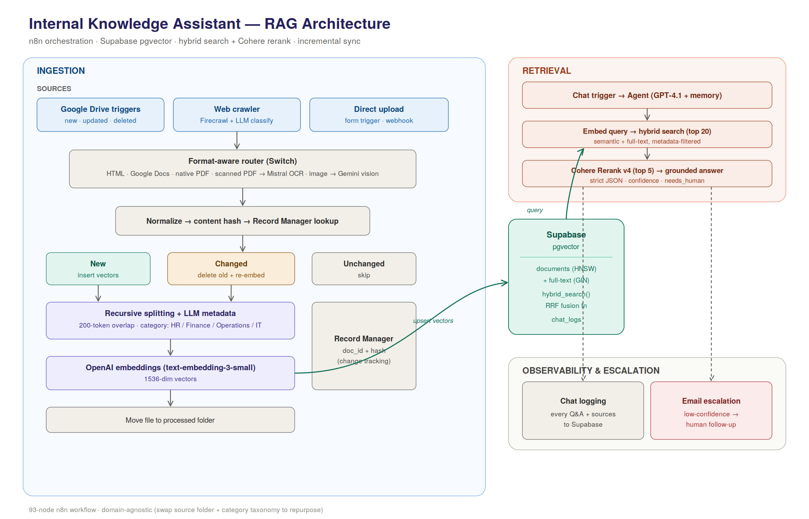

# Internal Knowledge Assistant — Hybrid RAG Pipeline

> A grounded internal knowledge assistant that answers employee questions from company documentation — built on n8n, Supabase pgvector, and OpenAI with hybrid search, cross-encoder reranking, and incremental index sync. Developed as a client consulting engagement; released here with a synthetic demo dataset.

---

## Problem Statement

Most organisations accumulate internal knowledge across dozens of formats — policy PDFs, scanned forms, intranet pages, Google Docs — with no reliable way for employees to query them. Generic search returns keyword matches without understanding. LLMs answer fluently but hallucinate when they don't know. And every existing RAG tutorial stops at the happy path: embed, store, retrieve, generate.

Real internal knowledge systems have harder problems:

- Documents change, get superseded, or are deleted — the index has to stay in sync
- Exact terms (policy codes, form numbers, system names) don't embed well, so pure vector search misses them
- Scanned documents and annotated images contain information that text extraction can't reach
- An answer the model invented is worse than no answer — grounding has to be a guarantee, not a hope

This project is an attempt to build the version that actually ships to employees.

---

## Solution Overview

An end-to-end RAG pipeline that ingests documents from multiple sources and formats, indexes them with hash-based change detection so the vector store stays current, and answers employee questions with a hybrid retrieval + reranking approach that significantly outperforms naive similarity search — with a strict grounding policy that escalates to a human when it can't answer confidently.

The architecture is domain-agnostic. The demo runs as an **HR / Finance / Operations / IT knowledge assistant** for a fictional company, but swapping the source folder and the two-line category taxonomy in the classification prompts is all it takes to repurpose it for any domain.

---

## Project Status

This pipeline was designed and built end-to-end as a consulting engagement — architecture, hybrid-search database function, ingestion branches, grounding policy, and escalation flow are complete and tested against the demo dataset in this repo. During final review, the client expanded the requirements toward an agentic architecture with retrieval over structured SQL data, so this v1 was not rolled out as-is; that expanded scope is a separate phase of work. The repository is published (with all client-specific content replaced by synthetic data) as a reference implementation of production-grade RAG patterns: incremental sync, hybrid retrieval with RRF, cross-encoder reranking, and grounding-as-policy.

---

## Key Features

| Feature | Detail |
|---|---|
| **Incremental index sync** | Hash-based record manager: new docs are inserted, changed docs have stale vectors replaced, deleted docs are purged — no full re-embed on every update |
| **Hybrid search (RRF)** | Postgres function combining pgvector cosine similarity + full-text search, fused with Reciprocal Rank Fusion (k=50) and JSONB metadata filtering |
| **Cross-encoder reranking** | Cohere Rerank v4 re-scores top 20 candidates and passes only the best 5 to the LLM — improves precision and cuts prompt tokens |
| **Multi-format ingestion** | Native PDFs · scanned PDFs (Mistral OCR) · images (Gemini vision) · HTML/web (Firecrawl) · Google Docs |
| **LLM classification at ingest** | GPT-4.1-mini classifies and summarises every document once at ingest; metadata used for cheap filtered retrieval at query time |
| **Strict grounding policy** | Context-only answers · prefer-most-recent conflict resolution · explicit "I don't know" path with `needs_human` flag |
| **Observability & escalation** | Every Q&A logged to Supabase `chat_logs` · low-confidence answers trigger email escalation to a human |
| **Multi-source triggers** | Google Drive (new / updated / deleted file events) · Firecrawl web crawler · direct file upload · webhook |

---

## Technical Stack

**Orchestration:** n8n (80+ node workflow, modular sub-flows)

**Vector store:** Supabase pgvector — HNSW index (`vector_cosine_ops`) + GIN index for full-text, with a custom hybrid-search Postgres function and Deno edge function

**Models:**
- GPT-4.1 — conversational agent with buffer memory
- GPT-4.1-mini — document classification and structured output parsing
- Gemini — image understanding (annotated documents, photos)
- text-embedding-3-small — 1536-dim embeddings
- Cohere Rerank v4 — cross-encoder reranking
- Mistral OCR — scanned PDF text extraction

**Ingestion sources:** Google Drive, Firecrawl web crawler, direct upload (form trigger / webhook)

**Languages / tools:** TypeScript (Deno edge function) · SQL (pgvector, RRF function) · n8n LangChain nodes

---

## Architecture



<details>
<summary>Text version</summary>

```
                        ┌────────────────────── INGESTION ──────────────────────┐
  Google Drive triggers │  new / updated / deleted files                        │
  Web crawler           │  Firecrawl → page filter → LLM content classification │
  Direct upload         │  form trigger / webhook                               │
                        └───────────────────────┬───────────────────────────────┘
                                                ▼
                              Format router (Switch)
                  HTML │ Google Docs │ native PDF │ scanned PDF → Mistral OCR │ image → Gemini vision
                                                ▼
                       Normalize → hash → Record Manager lookup (Supabase)
                       ┌─────────────┬──────────────────┬──────────────┐
                       │ new: insert │ changed: replace │ same: skip   │
                       └─────────────┴────────┬─────────┴──────────────┘
                                              ▼
                  Recursive character splitting (200-token overlap)
                  → OpenAI text-embedding-3-small → Supabase pgvector
                  (+ LLM-generated metadata for filtered retrieval)

                        ┌────────────────────── RETRIEVAL ──────────────────────┐
  Chat trigger → Agent (GPT-4.1, buffer memory)                                 │
      └─ Query tool → embed query → hybrid search (top 20, metadata-filtered)   │
                     → Cohere Rerank v4 (top 5) → grounded answer               │
  Side effects: chat logging → Supabase · low-confidence → email escalation     │
                        └───────────────────────────────────────────────────────┘
```

</details>

### Key engineering decisions

**Record manager over naive re-indexing.** Re-embedding an entire corpus on every change is slow and expensive. Each document gets a content hash stored in a Supabase record-manager table; a Switch node routes to insert / replace / skip. Drive *delete* events trigger vector cleanup, so the index never serves answers from documents that no longer exist.

**Hybrid search over pure vector similarity.** Internal documentation is full of exact tokens (policy codes, form numbers, system names, acronyms) that embeddings handle poorly. The Postgres function runs pgvector cosine search and full-text search in parallel CTEs, then merges them with **Reciprocal Rank Fusion** (RRF, k=50) over a full outer join — so a document strong in either modality still surfaces. Metadata filters (`@>` containment on JSONB, e.g. `{"category": "HR"}`) apply to both branches, and the function returns per-modality scores and ranks alongside the fused score for debuggability.

**Rerank before generation.** A cross-encoder (Cohere Rerank v4) scoring query–document pairs is far more accurate than bi-encoder similarity alone. Passing 5 reranked chunks instead of 20 raw ones improves answer precision *and* cuts prompt tokens.

**LLM classification at ingest, not query time.** Web-crawled and uploaded content is classified once by GPT-4.1-mini with structured output parsing, stored as metadata, and used for cheap filtered retrieval forever after.

**Grounding as policy, not hope.** The agent's system prompt enforces context-only answers, dated-source conflict resolution, and an explicit refusal path — and low-confidence responses escalate to a human via email.

---

## Demo

The `demo-docs/` folder contains a complete synthetic dataset for a fictional company, **Northbridge Manufacturing**, covering all four department categories and all five ingestion source types the pipeline supports.

### Demo dataset

| File | Format | Category | Ingestion branch |
|------|--------|----------|-----------------|
| `employee_handbook_excerpt.pdf` | PDF | HR | native PDF |
| `benefits_enrollment_guide.pdf` | PDF | HR | native PDF |
| `expense_policy_annotated.png` | image | Finance | image → Gemini vision |
| `procurement_policy.pdf` | PDF | Finance | native PDF |
| `ops_runbook_shift_handover_scanned.pdf` | scanned PDF | Operations | scanned PDF → Mistral OCR |
| `it_security_policy.pdf` | PDF | IT | native PDF |
| `it_help_software_hardware.html` | web page | IT | web → Firecrawl |

### Sample queries

Try these after ingesting the demo docs:

| Question | Expected source | Tests |
|---|---|---|
| *"How many vacation days do I get?"* | `employee_handbook_excerpt.pdf` | basic HR retrieval |
| *"What's the daily meal allowance for domestic travel?"* | `expense_policy_annotated.png` | image ingestion via Gemini |
| *"Who approves a $25,000 purchase?"* | `procurement_policy.pdf` | Finance retrieval with exact numbers |
| *"What do I do if a production line stops for over an hour?"* | `ops_runbook_shift_handover_scanned.pdf` | scanned PDF via Mistral OCR |
| *"How do I request a new laptop?"* | `it_help_software_hardware.html` | web-sourced content |
| *"What is the parental leave policy?"* | *(not in any document)* | guardrail + email escalation |

The last query is intentionally unanswerable — it verifies the `needs_human: true` path fires instead of the model fabricating a policy.

See `demo-docs/sample_queries.json` for the full golden set with expected answer facts and `needs_human` flags.

---

## Repository Structure

```
├── hybrid-rag-pipeline.json            # n8n workflow — import this
├── assets/
│   └── architecture-diagram.png        # system architecture diagram
├── demo-docs/                          # synthetic dataset (fictional company)
│   ├── *.pdf / *.png / *.html          # source files covering all ingestion branches
│   ├── sample_metadata.json            # expected classification per file
│   └── sample_queries.json             # golden Q&A set with expected facts + needs_human
├── sql/
│   ├── tables.sql                      # documents, record_manager, chat_logs + HNSW / GIN indexes
│   └── hybrid_search_with_details.sql  # RRF hybrid-search Postgres function
└── supabase/functions/hybrid-search/
    └── index.ts                        # Deno edge function exposing the search RPC
```

---

## Setup

1. **Supabase:** create a project, enable the `pgvector` extension, then run `sql/tables.sql` followed by `sql/hybrid_search_with_details.sql` in the SQL editor. Deploy the edge function: `supabase functions deploy hybrid-search`.
2. **n8n:** import `hybrid-rag-pipeline.json`, then map your own credentials for OpenAI, Supabase, Google Drive/Docs, Mistral, Cohere, Firecrawl, and SMTP. Set your Supabase project URL in the Hybrid Search node. All credential IDs, webhook IDs, folder IDs, and instance URLs are placeholders.
3. **Google Drive:** create ingest and processed folders; point the three Drive trigger nodes and the Move File node at them.
4. **Test end-to-end:** drop the files from `demo-docs/` into the ingest folder, then ask the chat the sample questions above. The last one (*parental leave*) should escalate to email rather than answer.

---

## Lessons Learned

**Incremental sync is non-negotiable in production.** The first version re-embedded the whole corpus on every update. At small scale this is fine; it becomes a bottleneck and a cost sink the moment the corpus grows. The record manager pattern (hash → compare → insert / replace / skip) should be in every production RAG system from day one.

**Hybrid search materially outperforms pure vector search on internal docs.** Policy documents are dense with exact tokens — form codes, system names, dollar thresholds, numbered procedures — that embeddings approximate rather than match exactly. Adding full-text search alongside cosine similarity and fusing with RRF recovered a meaningful number of queries that vector-only missed entirely, without hurting the queries it already handled well.

**Reranking changes the answer, not just the ranking.** The intuition going in was that reranking would mostly reorder similar chunks. In practice, the cross-encoder scores diverge significantly from bi-encoder similarity — chunks ranked 12–18 by cosine similarity sometimes score highest by the cross-encoder. The five chunks that reach the LLM are meaningfully different with reranking on, and the answers reflect that.

**The refusal path is as important as the retrieval path.** An answer the model invented is worse than no answer, especially for HR and policy questions. Engineering the `needs_human` flag, the grounding-only system prompt, and the email escalation as first-class features — not afterthoughts — is what makes the system trustworthy enough to actually deploy to employees.

**Image ingestion is the hardest branch to get right.** Scanned PDFs via Mistral OCR were straightforward. Annotated images (handwritten notes, highlighted text, mixed content) required a vision-capable model (Gemini) and careful prompt design to extract not just the typed text but the annotations. Getting the output into a form the chunker could handle cleanly took several iterations.

**Metadata at ingest pays dividends at query time.** Classifying each document once at ingest and storing `category` as JSONB metadata makes filtered retrieval essentially free. The alternative — classifying at query time — adds latency and cost on every single request. The ingest-time cost is paid once; the retrieval-time savings compound.

---

## Roadmap

- [ ] Retrieval evaluation harness (golden Q&A set, recall@k / MRR before–after reranking)
- [ ] Token/cost telemetry per query


---

*Built by Syed Abidur Rahman — senior software engineer (15+ yrs) applying production engineering practices to LLM systems. [LinkedIn](https://www.linkedin.com/in/syed-rahman-77281645/)*
